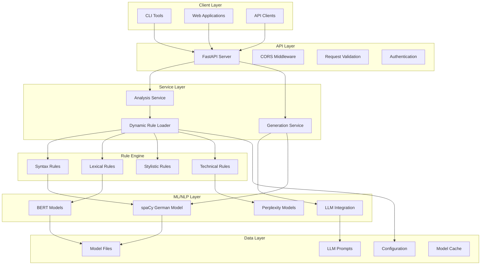
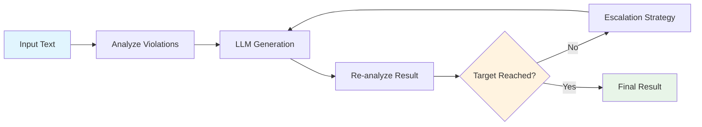
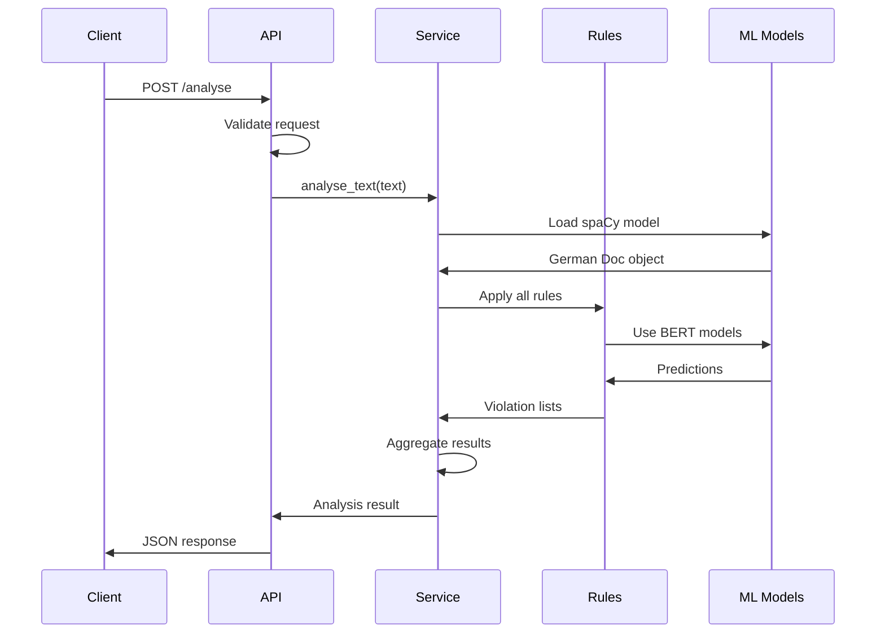
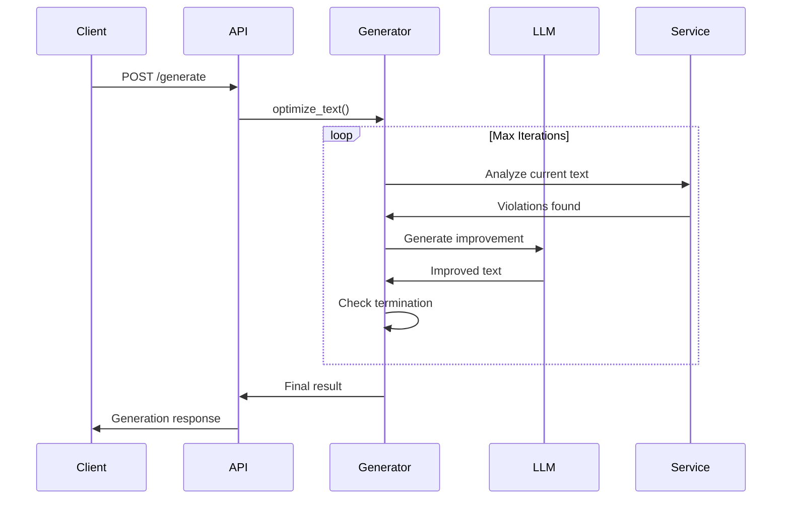
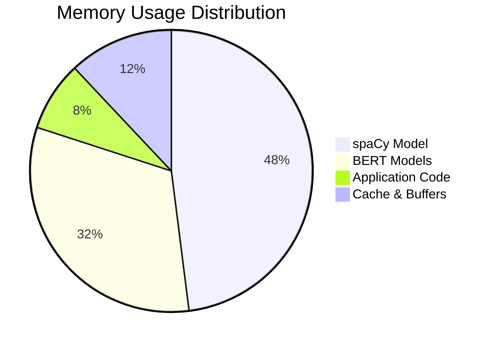
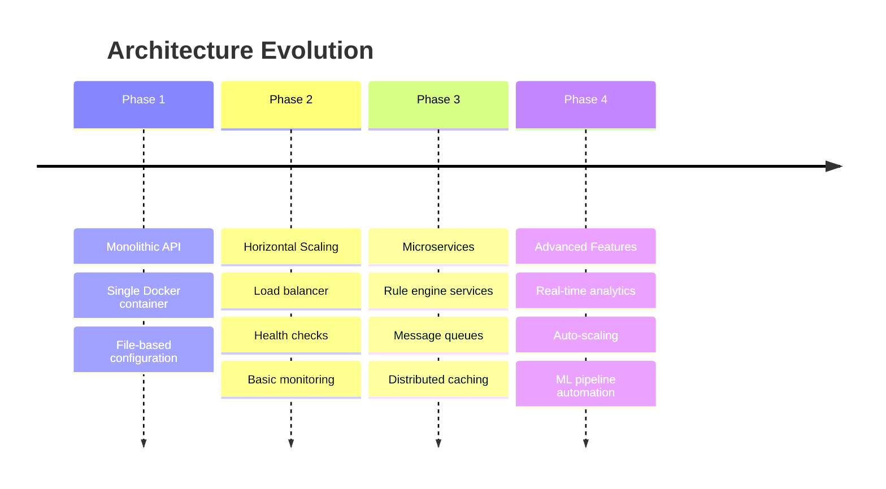

# System Overview

This document provides a high-level overview of the Leichte Sprache API architecture, design decisions, and system components.

## Architecture Philosophy

The system is designed with several key principles:

- **Modularity**: Rules are self-contained and dynamically loaded
- **Extensibility**: Easy addition of new rules and features
- **Performance**: Efficient processing of large texts
- **Reliability**: Robust error handling and graceful degradation
- **Maintainability**: Clear separation of concerns and comprehensive testing

## High-Level Architecture



## Core Components

### 1. FastAPI Application (`api_main.py`)

The REST API server built with FastAPI providing:

- **HTTP endpoints** for analysis and generation
- **Request/response validation** with Pydantic models
- **OpenAPI documentation** auto-generation
- **CORS support** for web applications
- **Error handling** and standardized responses

**Key Features:**
```python
app = FastAPI(
    title="Leichte Sprache API",
    description="REST-API für die Analyse von deutschen Texten",
    version="1.0.0",
    docs_url="/docs",
    redoc_url="/redoc"
)
```

### 2. Analysis Service (`analysis_service.py`)

Core business logic for text analysis:

- **German text processing** with spaCy
- **Dynamic rule discovery** and loading
- **Violation detection** and annotation
- **Statistics generation**
- **Performance optimization** with singleton patterns

**Architecture Patterns:**
- **Singleton**: SpaCy model loading
- **Factory**: Rule instantiation
- **Strategy**: Pluggable rule implementations

### 3. Rule Engine (`regeln/` directory)

Modular rule system with 18 specialized rules:

#### Rule Categories

| Category | Rules | Technology | Purpose |
|----------|-------|------------|---------|
| **Syntax** | Sentence length, subordinate clauses, passive voice | spaCy parsing | Grammar structure analysis |
| **Lexical** | Foreign words, compound words, complexity | BERT, spaCy | Vocabulary complexity |
| **Stylistic** | Negations, idioms, pronouns | Pattern matching | Writing style |
| **Technical** | Numbers, abbreviations, punctuation | BERT, regex | Technical compliance |

#### Dynamic Rule Loading

```python
def load_rules():
    """Dynamically discover and load all rule modules."""
    rules = {}
    regeln_dir = Path("regeln")

    for rule_dir in regeln_dir.iterdir():
        if rule_dir.is_dir() and (rule_dir / "regel.py").exists():
            module = importlib.import_module(f"regeln.{rule_dir.name}")
            rules[rule_dir.name] = module.pruefe_regel

    return rules
```

### 4. ML/NLP Components

#### spaCy Integration

- **German language model**: `de_core_news_lg`
- **Linguistic analysis**: POS tagging, dependency parsing, NER
- **Sentence segmentation**: Accurate German sentence boundaries
- **Token classification**: Word-level analysis

#### BERT Models

Specialized BERT models for complex tasks:

```python
# Abbreviation detection
model = AutoModelForTokenClassification.from_pretrained(
    "regeln/abkuerzungen/model/"
)

# Complexity scoring
complexity_model = AutoModelForSequenceClassification.from_pretrained(
    "regeln/komplexitaet/textkomplexitaet/"
)
```

#### LLM Integration (`tools/agent_optimizer.py`)

Multi-provider LLM support:

- **OpenAI**: GPT-4, GPT-3.5
- **Anthropic**: Claude Sonnet, Opus
- **Google**: Gemini Pro, Flash
- **Ollama**: Local model inference
- **Mistral**: Mistral Large, Medium

### 5. Generation Engine

Iterative text improvement system:



#### Escalation Strategies

| Level | Strategy | Description |
|-------|----------|-------------|
| 0 | **Normal** | Standard prompt with all violations |
| 1 | **Focused** | Top 5 priority violations only |
| 2 | **High Temperature** | Increased creativity (temp=0.9) |
| 3 | **Rule-by-Rule** | Single rule category focus |

## Data Flow

### Text Analysis Flow



### Text Generation Flow



## Performance Characteristics

### Analysis Performance

| Text Size | Processing Time | Memory Usage |
|-----------|----------------|---------------|
| < 1,000 words | < 2 seconds | ~2GB |
| 1,000-5,000 words | 2-10 seconds | ~2.5GB |
| > 5,000 words | 10-30 seconds | ~3GB |

### Memory Usage by Component



### Bottleneck Analysis

1. **Model Loading**: 30-60 seconds on first startup
2. **BERT Inference**: ~100ms per complex rule
3. **Compound Word Analysis**: ~840ms for regel_komposita
4. **Network I/O**: Variable for LLM calls

## Scalability Considerations

### Horizontal Scaling

```yaml
# Docker Swarm / Kubernetes setup
services:
  api:
    image: acolono/leichte-sprache-api
    replicas: 3
    deploy:
      resources:
        limits:
          memory: 8G
          cpus: '2.0'
```

### Caching Strategy

- **Model caching**: Singleton spaCy and BERT models
- **Response caching**: Redis for repeated text analysis
- **LLM optimization**: Cross-request learning patterns

### Load Balancing

```nginx
upstream leichte_sprache {
    server api1:8000;
    server api2:8000;
    server api3:8000;
}

server {
    location / {
        proxy_pass http://leichte_sprache;
        proxy_set_header Host $host;
    }
}
```

## Security Architecture

### Input Validation

- **Request size limits**: 50KB for analysis, 10KB for generation
- **Content filtering**: Malicious input detection
- **Rate limiting**: Per-IP request throttling

### API Security

```python
# Security headers
app.add_middleware(
    CORSMiddleware,
    allow_origins=["*"],  # Configure for production
    allow_credentials=True,
    allow_methods=["GET", "POST"],
    allow_headers=["*"]
)
```

### Secret Management

- **Environment variables**: API keys and configuration
- **No logging**: Sensitive data excluded from logs
- **Secure defaults**: Conservative security settings

## Monitoring and Observability

### Health Checks

```python
@app.get("/health")
async def health_check():
    """Comprehensive health check."""
    try:
        # Test core functionality
        result = analyse_text("Test.")
        return {"status": "healthy", "timestamp": time.time()}
    except Exception as e:
        return {"status": "unhealthy", "error": str(e)}
```

### Metrics Collection

- **Response times**: Per endpoint performance
- **Error rates**: 4xx/5xx response tracking
- **Resource usage**: Memory and CPU monitoring
- **Rule performance**: Individual rule execution times

### Logging Strategy

```python
import logging

# Structured logging
logging.basicConfig(
    format='%(asctime)s - %(name)s - %(levelname)s - %(message)s',
    level=logging.INFO
)

logger = logging.getLogger(__name__)
```

## Design Decisions

### Why FastAPI?

- **Performance**: Async support and high throughput
- **Documentation**: Auto-generated OpenAPI specs
- **Validation**: Pydantic integration for type safety
- **Developer Experience**: Excellent tooling and debugging

### Why spaCy?

- **German support**: Excellent German language model
- **Performance**: Fast C++ implementation
- **Accuracy**: State-of-the-art linguistic analysis
- **Ecosystem**: Rich plugin ecosystem

### Why Modular Rules?

- **Maintainability**: Each rule is independently testable
- **Extensibility**: Easy to add new rules
- **Performance**: Can disable unused rules
- **Clarity**: Clear separation of concerns

### Why Multiple LLM Providers?

- **Redundancy**: Fallback options for reliability
- **Cost optimization**: Choose provider by price/performance
- **Local deployment**: Ollama for data privacy
- **Quality diversity**: Different models for different use cases

## Future Architecture Considerations

### Planned Improvements

1. **Microservices**: Split rule engine into separate services
2. **Message Queues**: Async processing for long texts
3. **Caching Layer**: Redis for response caching
4. **Real-time Monitoring**: Prometheus and Grafana integration
5. **A/B Testing**: Framework for rule improvement testing

### Scalability Roadmap



## Development Workflow

### Local Development

```bash
# Start development environment
python api_main.py  # Auto-reload enabled

# Run tests
python test-suite/test_runner.py

# Check code quality
ruff check .
black --check .
```

### CI/CD Pipeline

```yaml
# .github/workflows/test.yml
name: Test Suite
on: [push, pull_request]
jobs:
  test:
    runs-on: ubuntu-latest
    steps:
      - uses: actions/checkout@v4
      - name: Set up Python
        uses: actions/setup-python@v4
        with:
          python-version: '3.12'
      - name: Run tests
        run: python test-suite/test_runner.py
```

This architecture provides a solid foundation for the Leichte Sprache API while maintaining flexibility for future enhancements and scalability requirements.