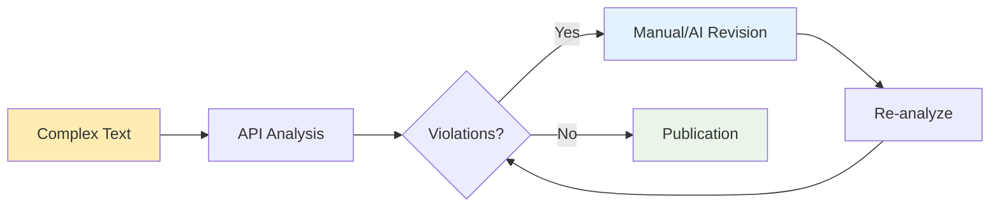

# Overview

## What is Leichte Sprache?

**Leichte Sprache** (Simple Language) is a regulated form of German designed to be easily understood by people with learning difficulties, cognitive disabilities, or limited language proficiency. It follows specific rules for vocabulary, grammar, and text structure to maximize comprehension.

### Key Principles

- **Simple vocabulary**: Use common, everyday words
- **Short sentences**: Maximum 15 words per sentence
- **Clear structure**: One main idea per sentence
- **Active voice**: Avoid passive constructions
- **Concrete language**: Avoid abstract concepts and metaphors
- **Logical order**: Present information chronologically
- **Visual aids**: Support text with images and symbols

## Legal Framework

### Austria
Leichte Sprache is increasingly required under Austrian accessibility legislation:

- **Web-Zugänglichkeits-Gesetz (WZG)**: Mandates accessible web content for public sector
- **Bundes-Behindertengleichstellungsgesetz (BGStG)**: Anti-discrimination law requiring accessible information
- **UN Convention on Rights of Persons with Disabilities**: International treaty ratified by Austria

### Target Groups

According to research, Leichte Sprache benefits:

- **14 million German speakers** with reading difficulties
- **7.5 million adults** with functional illiteracy
- **People with intellectual disabilities**
- **Non-native speakers** learning German
- **Elderly people** with cognitive changes
- **People with dementia or brain injuries**

## API Capabilities

This API provides comprehensive support for Leichte Sprache compliance:

### Analysis Features

| Feature | Description | Benefit |
|---------|-------------|---------|
| **Real-time Analysis** | Instant feedback on text complexity | Immediate compliance checking |
| **18 Rule Categories** | Comprehensive coverage of all aspects | Complete Leichte Sprache validation |
| **Detailed Feedback** | Specific violations with suggestions | Actionable improvement guidance |
| **Batch Processing** | Handle multiple texts simultaneously | Efficient large-scale processing |

### Generation Features

| Feature | Description | Benefit |
|---------|-------------|---------|
| **LLM Transformation** | AI-powered text simplification | Automated first draft creation |
| **Iterative Optimization** | Multi-round improvement process | High-quality output |
| **Quality Scoring** | HIX readability and faithfulness metrics | Objective quality assessment |
| **Provider Choice** | Multiple AI models available | Flexibility and redundancy |

## Use Cases

### Content Creation Workflow

### Integration Scenarios

1. **CMS Integration**: Automated compliance checking in content management systems
2. **Document Processing**: Batch analysis of existing document libraries
3. **Translation Workflows**: Post-translation simplification for accessibility
4. **Educational Tools**: Real-time feedback for content creators learning Leichte Sprache
5. **Quality Assurance**: Pre-publication validation in government and healthcare

## Performance Characteristics

### Analysis Speed
- **Simple texts** (< 1000 words): < 2 seconds
- **Complex texts** (1000-5000 words): 2-10 seconds
- **Large documents** (> 5000 words): 10-30 seconds

### Generation Speed
- **Depends on text length and complexity**
- **Average**: 5-15 seconds per iteration
- **Typical workflow**: 3-5 iterations
- **Total time**: 15-75 seconds

!!! tip "Performance Optimization"
    - Use format=annotated_text for faster analysis-only responses
    - Implement client-side caching for repeated analysis
    - Consider batch processing for multiple documents

## Getting Started

Ready to begin? Follow these next steps:

1. **[Quick Start](quick-start.md)**: Set up and run your first analysis
2. **[Installation](installation.md)**: Detailed setup instructions
3. **[Configuration](configuration.md)**: Customize the API for your needs

## Need Help?

- **Technical Issues**: Check the GitHub Issues page
- **Rule Questions**: Explore the API documentation
- **Development**: See [Contributing Guidelines](../development/contributing.md)