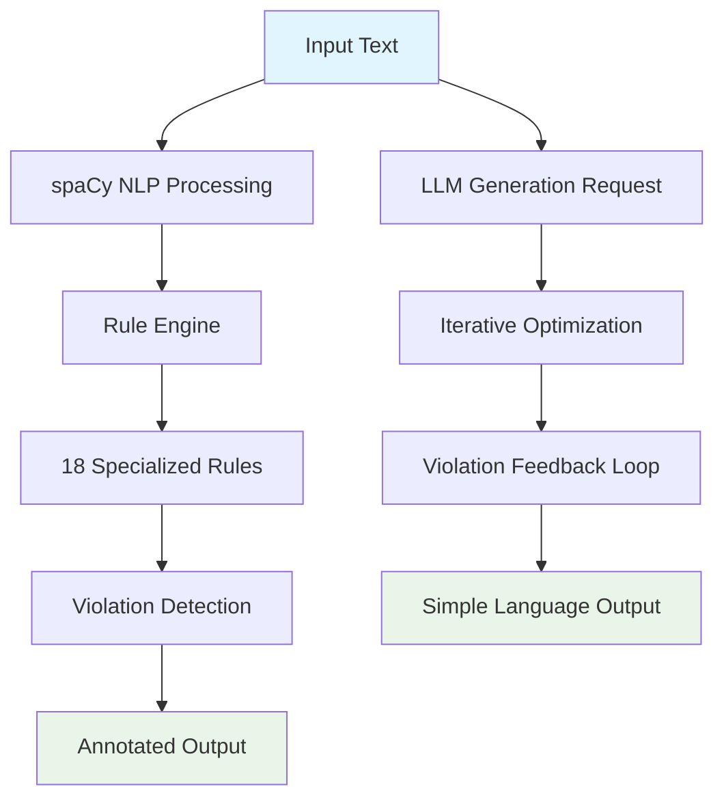

# Leichte Sprache API

## Welcome to the Developer Documentation

The **Leichte Sprache API** is a powerful German text analysis and generation service that helps make content accessible to people with cognitive disabilities by checking compliance with German accessibility writing rules.

## What is this project about?

This API provides automated analysis and transformation of German texts according to **Leichte Sprache** (Simple Language) standards - a regulated form of German designed to be easily understood by people with learning difficulties, cognitive disabilities, or limited language skills.

### Key Features

=== "Text Analysis"

    - **18 specialized rules** covering syntax, lexical, stylistic, and technical aspects
    - **Real-time violation detection** with detailed feedback
    - **Annotated text output** highlighting problematic areas
    - **Comprehensive statistics** and improvement suggestions

=== "Text Generation"

    - **LLM-powered transformation** to Simple Language
    - **Iterative optimization** with escalation strategies
    - **Multiple provider support** (OpenAI, Google, Ollama, Mistral, Anthropic)
    - **Quality scoring** with HIX readability index and faithfulness metrics

=== "Developer Experience"

    - **REST API** with OpenAPI/Swagger documentation
    - **Docker deployment** ready for production
    - **Comprehensive test suite** with 100+ test cases
    - **Dynamic rule engine** for easy extensibility

## Who is it for?

### Primary Users
- **Government agencies** ensuring accessibility compliance
- **Content creators** writing for diverse audiences
- **Educational institutions** adapting learning materials
- **Healthcare providers** making information accessible
- **Legal services** simplifying complex documents

### Developers
- **API integrators** building accessible content tools
- **ML engineers** working on text simplification
- **Accessibility experts** implementing compliance solutions
- **Researchers** studying text complexity and comprehension

## What problems does it solve?

!!! info "Accessibility Challenge"
    In Austria, **Leichte Sprache** is increasingly required for public information under accessibility legislation, including the Austrian Web-Zugänglichkeits-Gesetz (Web Accessibility Act) and UN Convention on the Rights of Persons with Disabilities. Manual compliance checking is time-consuming and requires specialized expertise.

### Before: Manual Process
- ❌ **Time-intensive** manual review by experts
- ❌ **Inconsistent** rule application
- ❌ **Limited scalability** for large content volumes
- ❌ **High costs** for specialized reviewers

### After: Automated Solution
- ✅ **Instant analysis** of any German text
- ✅ **Consistent rule application** across all content
- ✅ **Scalable processing** from single paragraphs to entire documents
- ✅ **Cost-effective** automated pre-screening and generation

## How does it work?



### Technical Architecture

1. **NLP Foundation**: Uses German spaCy model (`de_core_news_lg`) for linguistic analysis
2. **Rule Engine**: 18 dynamically-loaded rule modules covering all aspects of Leichte Sprache
3. **ML Components**: BERT-based models for complex tasks like abbreviation detection and complexity scoring
4. **LLM Integration**: Multi-provider support with intelligent escalation strategies
5. **REST API**: FastAPI with comprehensive validation and error handling

### Rule Categories

| Category | Rules | Examples |
|----------|-------|----------|
| **Syntax** | Sentence length, subordinate clauses, passive voice | Max 15 words per sentence |
| **Lexical** | Foreign words, compound words, complexity scoring | "Administration" → "Verwaltung" |
| **Stylistic** | Negations, idioms, personal pronouns | Avoid double negatives |
| **Technical** | Numbers, abbreviations, punctuation, grammar | "z.B." → "zum Beispiel" |

## Quick Start

Get started with the API in minutes:

```bash
# 1. Clone and setup
git clone https://github.com/acolono/leichte-sprache.git
cd leichte-sprache
uv venv && source .venv/bin/activate
uv sync

# 2. Download required models
uv run python -m spacy download de_core_news_lg

# 3. Start the API
python api_main.py

# 4. Test analysis
curl -X POST "http://localhost:8000/analyse" \
  -H "Content-Type: application/json" \
  -d '{"text": "Die komplexe Verwaltung organisiert eine außerordentliche Veranstaltung."}'
```

!!! tip "Docker Alternative"
    ```bash
    docker run -p 8000:8000 leichte-sprache-api
    ```

## Next Steps

<div class="grid cards" markdown>

-   :material-rocket-launch:{ .lg .middle } **Getting Started**

    ---

    Set up your development environment and run your first analysis

    [:octicons-arrow-right-24: Quick Start Guide](getting-started/quick-start.md)

-   :material-api:{ .lg .middle } **API Reference**

    ---

    Explore all endpoints, parameters, and response formats

    [:octicons-arrow-right-24: API Documentation](api/rest-api.md)

-   :material-cog:{ .lg .middle } **Architecture**

    ---

    Understand the system design and rule engine architecture

    [:octicons-arrow-right-24: System Overview](architecture/system-overview.md)

-   :material-code-braces:{ .lg .middle } **Contributing**

    ---

    Learn how to add rules, improve the system, and contribute code

    [:octicons-arrow-right-24: Developer Guide](development/contributing.md)

</div>

## Community and Support

- **Issues**: Report bugs and feature requests on [GitHub Issues](https://github.com/acolono/leichte-sprache/issues)
- **Discussions**: Join the community on [GitHub Discussions](https://github.com/acolono/leichte-sprache/discussions)
- **Documentation**: This comprehensive guide covers all aspects of development and usage

---

*Made with ❤️ for accessible communication*